# Catalogue des captures d'écran — Projet CI/CD Smartovate

**À lire avant de rédiger le rapport.** Ce document décrit chaque capture : ce
qu'elle montre, ce qu'elle démontre, et la légende à recopier sous l'image.

Les captures sont **numérotées dans l'ordre de lecture du rapport**. Un tri
alphabétique du dossier donne directement le bon ordre.

## Comment lire un nom de fichier

```
S3-14-target-group-health-check.png
│  │  └── sujet de la capture
│  └── numéro d'ordre dans le sprint
└── sprint concerné (S2 = Epic 2, S3 = Epic 3, S4 = Epic 4)
```

## Ordre de présentation retenu

Le cahier des charges numérote les Epics 2 → 3 → 4. Le projet a été réalisé dans
l'ordre **Sprint 3 → Sprint 2 → Sprint 4**, et ce catalogue suit cet ordre réel.

**Justification à reprendre dans le rapport :** l'étape de build produit un
fichier `imagedefinitions.json` qui doit désigner un conteneur appartenant à une
Task Definition existante. Construire l'infrastructure cible avant la chaîne de
build évite cette dépendance circulaire. Ce choix n'altère aucun critère
d'acceptation.

## Repères techniques utiles pour la rédaction

| Élément | Valeur |
|---|---|
| Compte AWS | `984675940976` |
| Région | `eu-west-3` (Paris) |
| VPC | `vpc-0361f96bf10cf9c41`, CIDR `10.0.0.0/16` |
| Sous-réseaux publics | `10.0.1.0/24` (eu-west-3a), `10.0.2.0/24` (eu-west-3b) |
| Repository ECR | `smartovate/demo-api`, privé, tags **IMMUTABLE**, scan on push |
| Cluster ECS | `smartovate-cicd-cluster` (Fargate) |
| Ressources CPU / mémoire | 256 unités (0,25 vCPU) / 512 Mo |
| Pipeline | `smartovate-cicd-pipeline` (V1) |

> ⚠️ L'identifiant de compte `984675940976` est visible sur plusieurs captures.
> Le masquer si le rapport est diffusé en dehors de l'entreprise.

---

# Sprint 3 — Epic 3 : Infrastructure cible ECS Fargate

> Couvre les **US 3.1** (cluster ECS + ALB via IaC) et **US 3.2** (Task
> Definition et Service Fargate).

## S3-01 — Plan Terraform initial

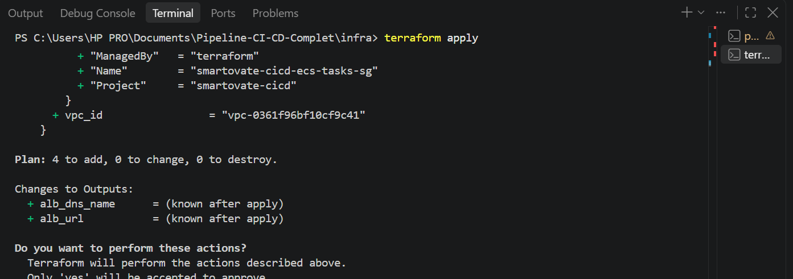

**Ce qu'on voit :** la sortie de `terraform plan`, se terminant par
`Plan: 4 to add, 0 to change, 0 to destroy.`

**Ce que ça démontre :** l'infrastructure est décrite en code et Terraform
annonce précisément ce qu'il va créer **avant** toute modification. Le
`0 to destroy` est le garde-fou vérifié systématiquement avant chaque `apply`.

> *Légende : « Plan Terraform : les ressources sont annoncées et validées avant
> toute création. »*

## S3-02 et S3-03 — Reprise en gestion de ressources orphelines

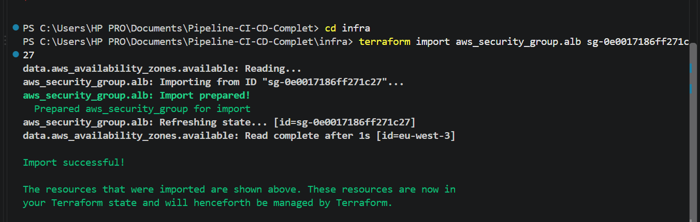
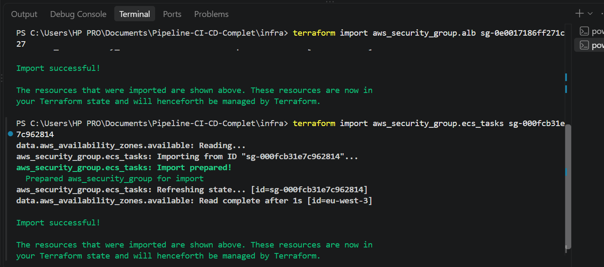

**Ce qu'on voit :** deux commandes `terraform import` suivies de
`Import successful!`.

**Contexte — à raconter dans la partie « difficultés rencontrées » :** une
coupure réseau pendant un `apply` a créé les Security Groups côté AWS sans que
Terraform ne parvienne à enregistrer le résultat dans son fichier d'état. Les
ressources existaient donc dans le cloud tout en étant inconnues de Terraform,
qui tentait de les recréer et échouait sur `InvalidGroup.Duplicate`.

**Point technique à valoriser :** `terraform plan` ne rafraîchit que les
ressources **déjà présentes dans l'état**. Une ressource existante mais non
suivie lui est totalement invisible. L'état Terraform n'est pas un miroir du
cloud : c'est la liste de ce que Terraform croit gérer.

> *Légende : « Reprise en gestion de ressources orphelines par `terraform
> import`, sans destruction ni recréation. »*

## S3-04 — Plan de contrôle après import

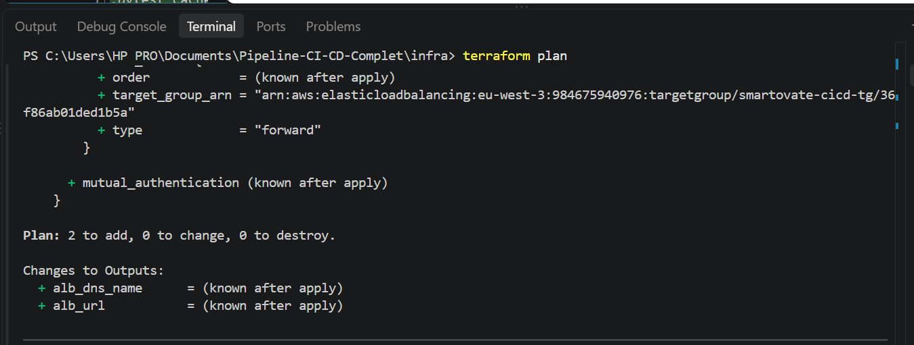

**Ce qu'on voit :** `Plan: 2 to add, 0 to change, 0 to destroy.`

**Ce que ça démontre :** le `0 to change` prouve que les ressources importées
correspondent **exactement** au code. L'import a réconcilié l'état sans
introduire d'écart de configuration.

> *Légende : « Vérification post-import : aucune divergence entre le code et
> l'infrastructure réelle. »*

## S3-05 — Le VPC

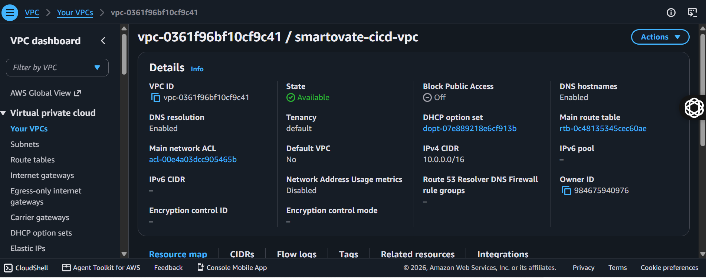

**Ce qu'on voit :** le VPC `smartovate-cicd-vpc`, CIDR `10.0.0.0/16`, résolution
et noms DNS activés.

**Ce que ça démontre :** un réseau privé isolé, dédié au projet. Les options DNS
sont indispensables pour que les tâches Fargate résolvent l'endpoint ECR d'où
elles téléchargent leur image.

> *Légende : « VPC dédié au projet, plage d'adressage 10.0.0.0/16. »*

## S3-06 — Carte des ressources réseau

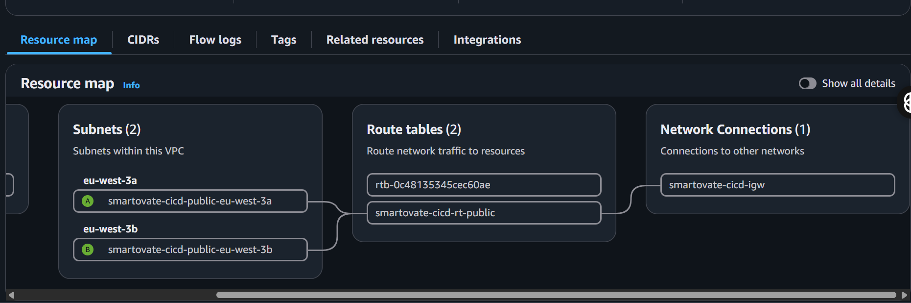

**Ce qu'on voit :** la vue schématique VPC → 2 sous-réseaux (eu-west-3a et
eu-west-3b) → table de routage → Internet Gateway.

**Ce que ça démontre :** c'est la **meilleure capture pour illustrer
l'architecture réseau** dans le rapport : elle rend visible d'un coup d'œil la
répartition sur deux zones de disponibilité et le chemin vers Internet.

> *Légende : « Architecture réseau : deux sous-réseaux publics répartis sur deux
> zones de disponibilité, routés vers Internet via l'Internet Gateway. »*

## S3-07 — Haute disponibilité : deux zones distinctes

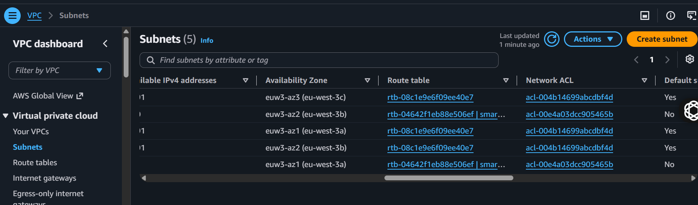

**Ce qu'on voit :** la colonne **Availability Zone** affichant `eu-west-3a` et
`eu-west-3b` pour les deux sous-réseaux du projet.

**Ce que ça démontre :** l'exigence de haute disponibilité de l'US 3.1. Un
Application Load Balancer **exige** au minimum deux sous-réseaux dans deux zones
différentes. Si un datacenter tombe, le service continue depuis l'autre.

> *Légende : « Répartition sur deux zones de disponibilité : socle de la haute
> disponibilité exigée par l'US 3.1. »*

## S3-08 et S3-09 — Les Security Groups

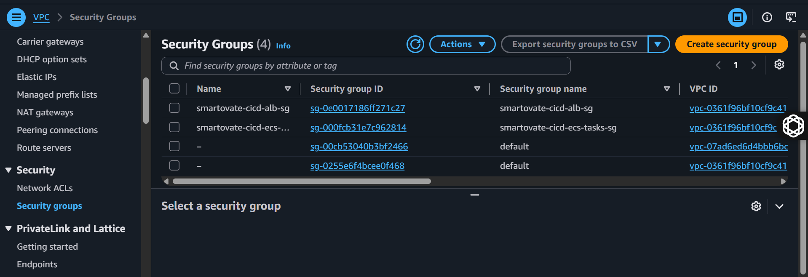
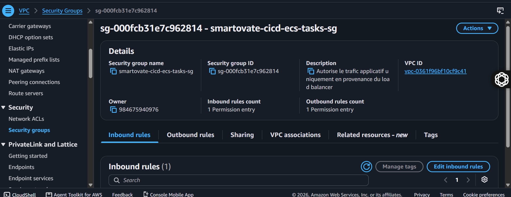

**Ce qu'on voit :** les deux groupes de sécurité créés
(`smartovate-cicd-alb-sg` et `smartovate-cicd-ecs-tasks-sg`), puis le détail du
second avec sa description.

> *Légende : « Deux groupes de sécurité distincts : un pour le load balancer,
> un pour les conteneurs. »*

## S3-10 — ⭐ Moindre privilège réseau

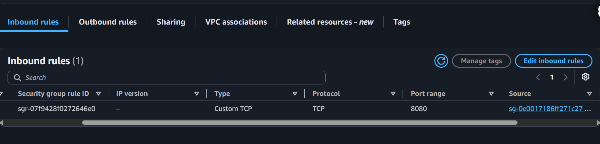

**Ce qu'on voit :** la règle entrante du groupe des conteneurs — port `8080`,
et surtout **Source = `sg-0e0017186ff271c27`**, c'est-à-dire le groupe de
sécurité de l'ALB, et non une plage d'adresses IP.

**Ce que ça démontre — capture importante :** on n'autorise pas « une plage
d'IP », on autorise **un composant précis de l'architecture**. Même si une tâche
possède une adresse IP publique, personne sur Internet ne peut l'atteindre
directement : tout trafic doit transiter par le load balancer.

> *Légende : « Application du principe de moindre privilège : les conteneurs
> n'acceptent que le trafic provenant du load balancer, exprimé par une
> référence entre groupes de sécurité plutôt que par une plage d'adresses. »*

## S3-11 et S3-12 — L'Application Load Balancer

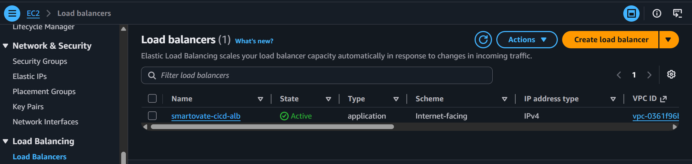
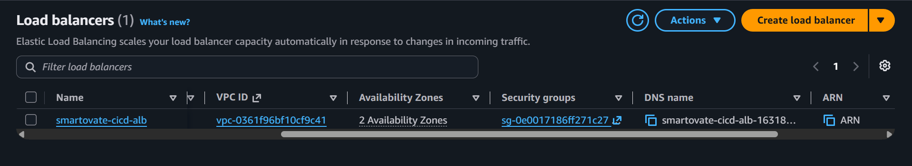

**Ce qu'on voit :** l'ALB `smartovate-cicd-alb` à l'état **Active**,
Internet-facing, puis le détail avec **2 Availability Zones** et son nom DNS
public.

**Ce que ça démontre :** le point d'entrée unique et public de l'application,
réparti sur deux zones. Le nom DNS est l'URL par laquelle l'application est
jointe.

> *Légende : « Application Load Balancer actif, exposé sur Internet et réparti
> sur deux zones de disponibilité. »*

## S3-13 — Target Group en mode IP

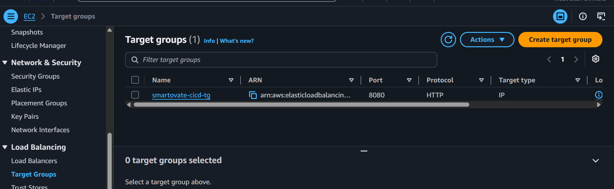

**Ce qu'on voit :** le Target Group, port `8080`, protocole HTTP, et
**Target type = IP**.

**Ce que ça démontre — subtilité technique à expliquer :** Fargate utilise le
mode réseau `awsvpc`, où chaque tâche reçoit sa propre interface réseau et sa
propre adresse IP. Il n'existe aucune instance EC2 à enregistrer : le type
`instance` ferait échouer la création du service.

> *Légende : « Target Group en mode IP, imposé par le mode réseau `awsvpc` de
> Fargate : chaque tâche dispose de sa propre interface réseau. »*

## S3-14 — Configuration du Health Check

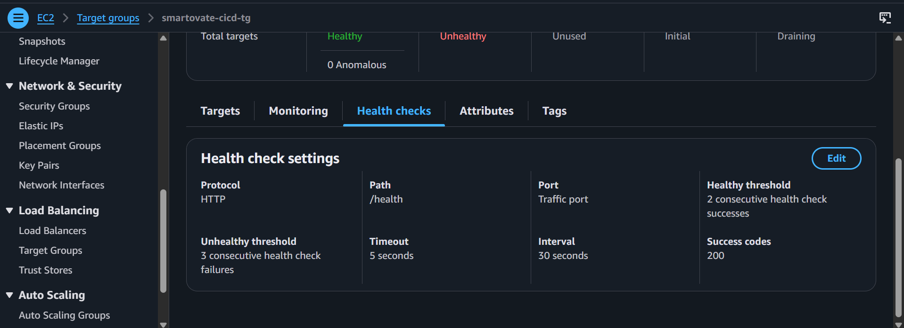

**Ce qu'on voit :** chemin `/health`, protocole HTTP, code de succès `200`,
intervalle 30 s, seuils 2 succès / 3 échecs.

**Ce que ça démontre :** la surveillance applicative, et la **prévention directe
du « Bug 1 »** anticipé au cahier des charges (échec de déploiement pour cause
de Health Check). La route `/health` est exposée volontairement par
l'application (`app/app.py`) à cette seule fin.

> *Légende : « Configuration du Health Check sur la route `/health` : mesure
> préventive contre l'échec de déploiement anticipé au cahier des charges. »*

## S3-15 — ⭐ AVANT déploiement : erreur 503

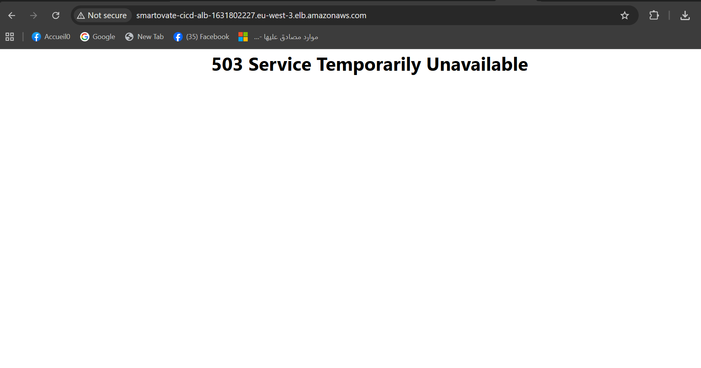

**Ce qu'on voit :** le navigateur sur l'URL de l'ALB affichant
**503 Service Temporarily Unavailable**.

**Ce que ça démontre :** le load balancer répond — il est donc opérationnel —
mais aucune cible saine n'est encore enregistrée derrière lui.

> **À placer impérativement en vis-à-vis de la capture S4-06.** Le couple
> avant/après est l'illustration la plus parlante du rapport.

> *Légende : « Avant déploiement : le load balancer répond mais ne dispose
> d'aucune cible saine. »*

## S3-16 et S3-17 — Image de démarrage dans ECR

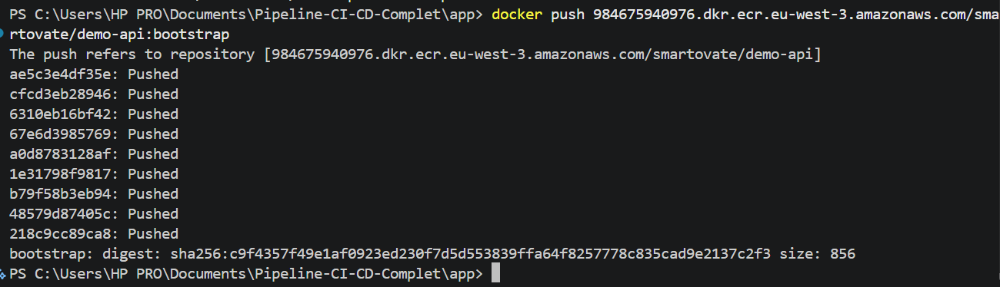
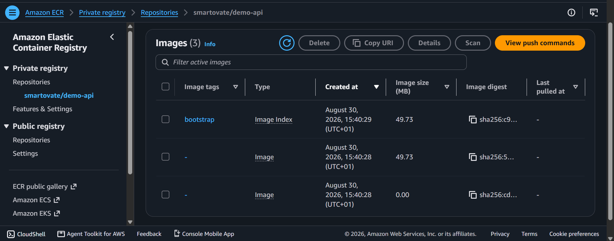

**Ce qu'on voit :** le `docker push` manuel de l'image `bootstrap`, puis cette
image visible dans le registre ECR.

**Ce que ça démontre :** la Task Definition référence une image qui doit exister
au préalable. Une image a donc été poussée manuellement **une seule fois**, pour
amorcer le système ; à partir du Sprint 2, CodeBuild s'en charge automatiquement.

> *Légende : « Amorçage manuel du registre ECR, unique intervention manuelle de
> la chaîne — automatisée dès le Sprint 2. »*

## S3-18 — Déploiement de l'infrastructure ECS

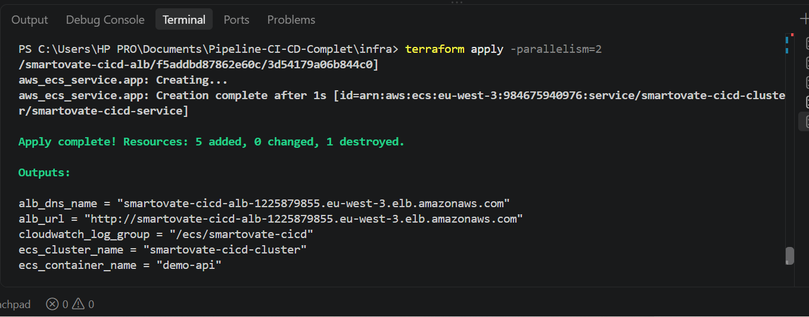

**Ce qu'on voit :** `Apply complete!` suivi des sorties Terraform, dont
`alb_dns_name` et `alb_url`.

**Ce que ça démontre :** l'infrastructure complète est déployée par une seule
commande, et Terraform restitue les informations utiles (URL publique, nom du
cluster, nom du conteneur).

> *Légende : « Déploiement complet de l'environnement d'exécution par une seule
> commande Terraform. »*

## S3-19 et S3-20 — Deux tâches Fargate en exécution

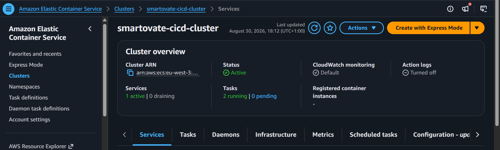
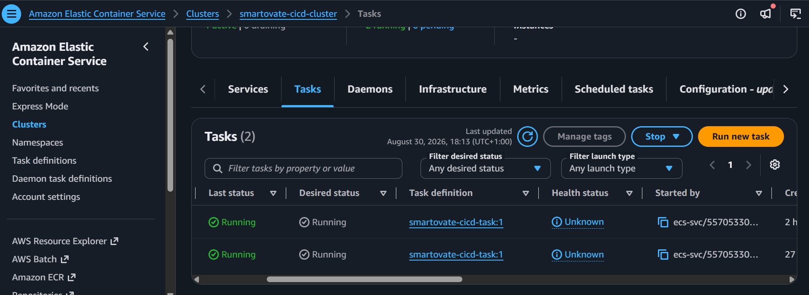

**Ce qu'on voit :** le cluster affichant **2 tâches en cours d'exécution**, puis
le détail des deux tâches à l'état `Running`.

**Ce que ça démontre :** le critère de l'US 3.2 — « maintenir au moins 2
instances de l'application ». Le service ECS surveille en permanence ce nombre et
relance automatiquement toute tâche défaillante.

> *Légende : « Service ECS maintenant deux tâches Fargate en exécution,
> conformément à l'US 3.2. »*

## S3-21 — La Task Definition

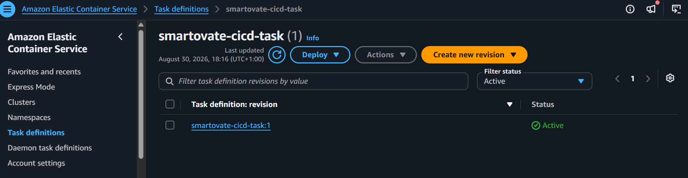

**Ce qu'on voit :** la Task Definition `smartovate-cicd-task`, révision 1, active.

**Ce que ça démontre :** la « recette » du conteneur. Elle est **immuable** :
chaque modification crée une nouvelle révision, ce qui permet de savoir
exactement ce qui tourne et de revenir en arrière. Ressources allouées :
0,25 vCPU et 512 Mo, comme l'exige l'US 3.2.

> *Légende : « Task Definition : 0,25 vCPU et 512 Mo. Chaque modification crée
> une révision, garantissant la traçabilité des déploiements. »*

## S3-22 — ⭐ Les cibles sont saines

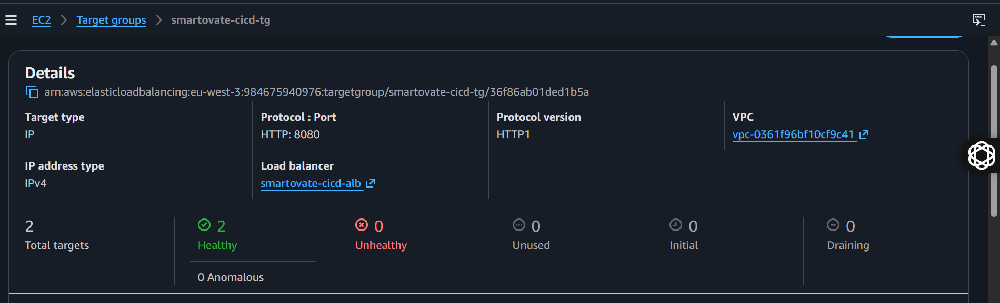

**Ce qu'on voit :** **2 Total targets, 2 Healthy, 0 Unhealthy**, et le Target
Group désormais associé au load balancer.

**Ce que ça démontre :** la chaîne complète fonctionne — les tâches sont
démarrées, enregistrées auprès de l'ALB, et répondent correctement au Health
Check. C'est la preuve technique que le trafic est bien servi.

> *Légende : « Les deux tâches passent le Health Check : le load balancer leur
> transmet le trafic. »*

## S3-23 — Centralisation des logs

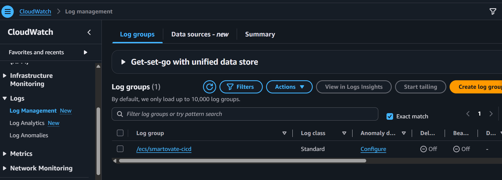

**Ce qu'on voit :** le groupe de logs `/ecs/smartovate-cicd` dans CloudWatch.

**Ce que ça démontre :** un conteneur Fargate ne dispose d'aucun disque
persistant. Sans centralisation, la sortie applicative serait perdue à chaque
redémarrage et tout diagnostic deviendrait impossible.

> *Légende : « Centralisation des logs applicatifs dans CloudWatch : condition
> du diagnostic en environnement conteneurisé éphémère. »*

---

# Sprint 2 — Epic 2 : Automatisation du build et des tests

> Couvre les **US 2.1** (projet CodeBuild, tests, image Docker) et **US 2.2**
> (push vers ECR, tag par SHA de commit, rôle IAM).

## S2-01 à S2-03 — Le fichier `buildspec.yml`

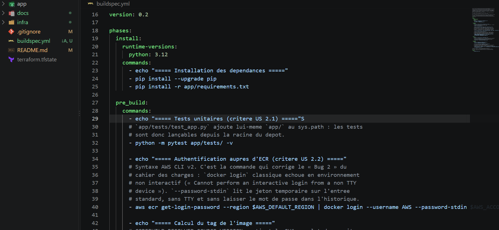
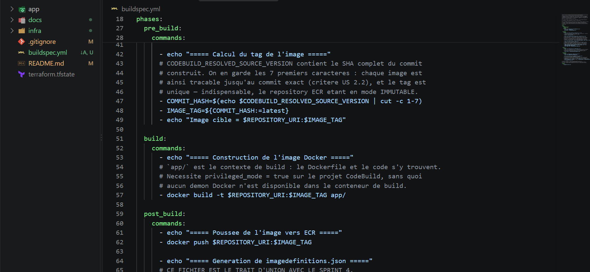
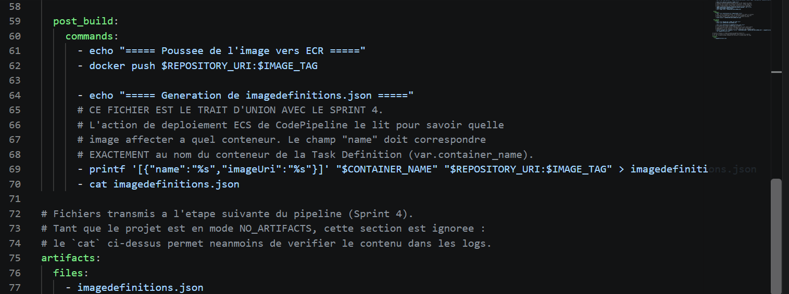

**Ce qu'on voit :** les quatre phases du fichier de build — `install`,
`pre_build`, `build`, `post_build`.

**Trois points à expliquer dans le rapport :**

1. **Les tests s'exécutent en `pre_build`**, avant la construction de l'image.
   Un test en échec interrompt immédiatement le build, sans consommer de temps
   de calcul inutile.
2. **Le tag de l'image provient du SHA du commit**
   (`CODEBUILD_RESOLVED_SOURCE_VERSION`, tronqué à 7 caractères). Toute image en
   production est ainsi traçable jusqu'à la ligne de code exacte.
3. **`imagedefinitions.json` est le trait d'union avec le Sprint 4** : ce fichier
   indique à l'étape de déploiement quelle image affecter à quel conteneur.

> *Légende : « Recette de build : tests unitaires, construction de l'image,
> publication vers ECR et génération du fichier de liaison avec l'étape de
> déploiement. »*

## S2-04 à S2-06 — Trois échecs successifs et leurs causes

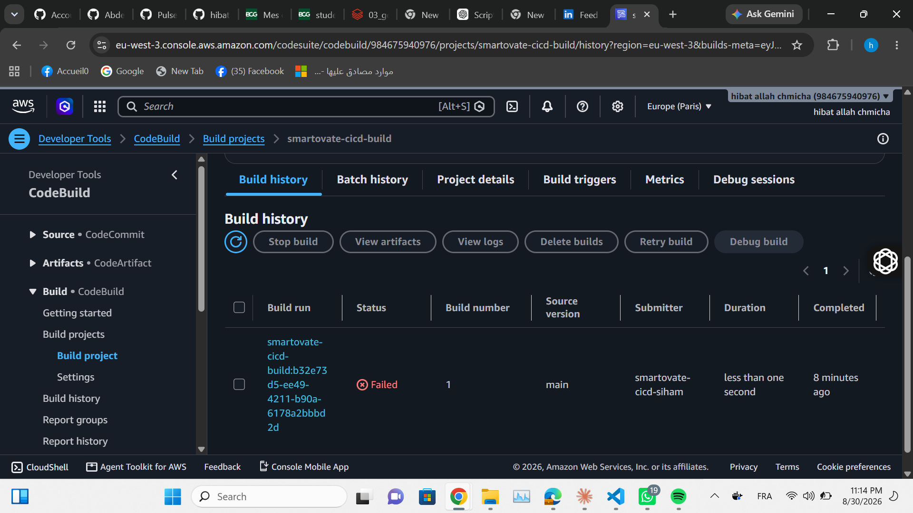
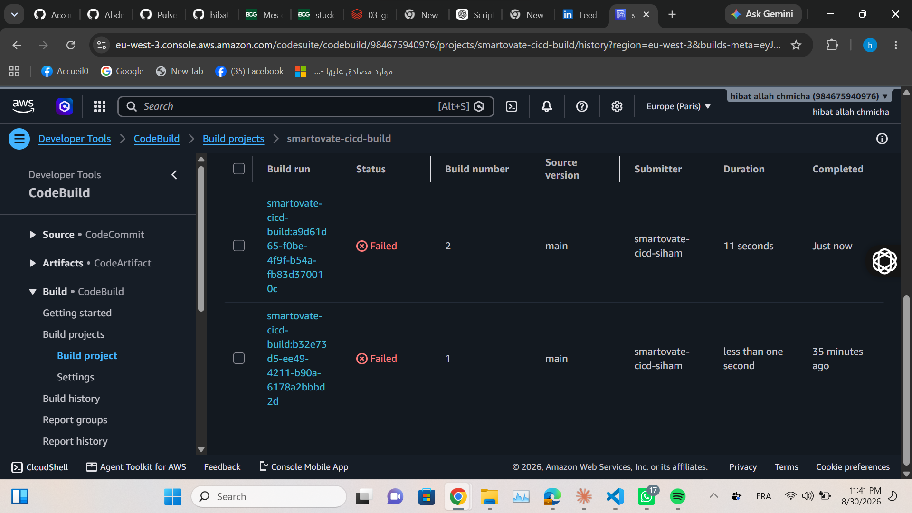
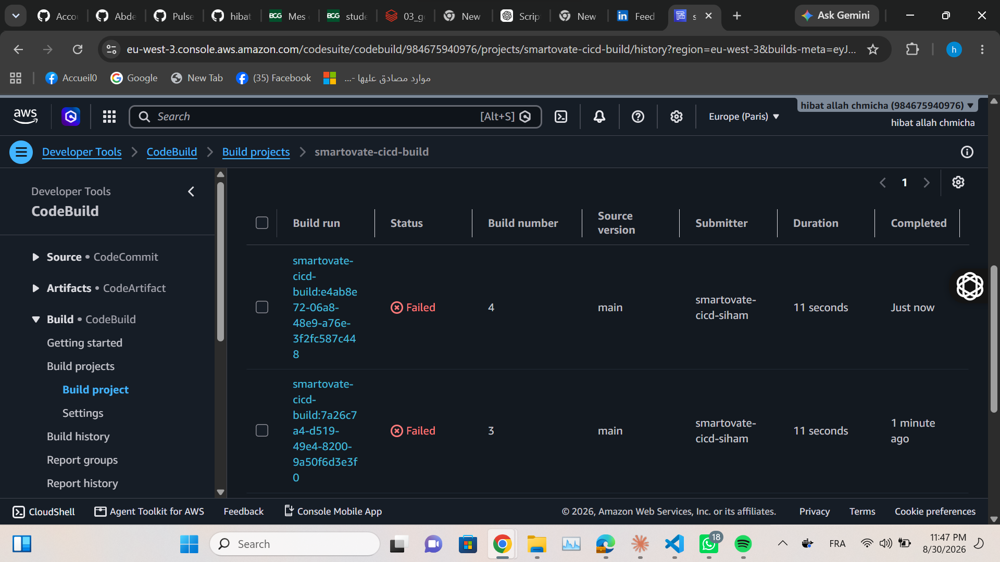

**Ce qu'on voit :** l'historique des builds en échec.

**À utiliser dans la section « difficultés rencontrées » — trois causes bien
distinctes :**

| Capture | Cause | Correction |
|---|---|---|
| **S2-04** | Le rôle IAM du projet existait sans aucune permission attachée : refus sur `logs:CreateLogStream` | Rattachement de la politique de permissions |
| **S2-05** | Le `buildspec.yml` présent sur le dépôt distant était un fichier vide de 0 octet | Publication de la version réelle du fichier |
| **S2-06** | CodeBuild clonait le dépôt d'origine alors que le code était poussé sur un fork | Correction de l'URL du dépôt source |

**Méthode de diagnostic à valoriser :** la comparaison du champ
`resolvedSourceVersion` d'un build avec le dernier commit du dépôt a révélé
que CodeBuild construisait un commit obsolète — cause invisible dans les logs.

> *Légende : « Trois échecs de nature différente — permissions, contenu du
> dépôt, configuration de la source — résolus par analyse des messages d'erreur
> et du commit réellement construit. »*

## S2-07 — Build réussi

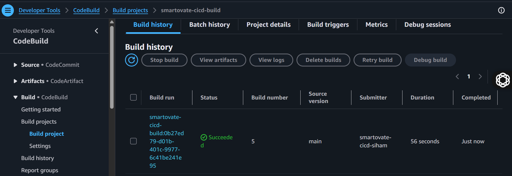

**Ce qu'on voit :** le build n° 5 à l'état **Succeeded** en 56 secondes.

> *Légende : « Chaîne de build automatisée fonctionnelle : tests, construction
> et publication de l'image en moins d'une minute. »*

## S2-08 — ⭐ Politique IAM du rôle CodeBuild

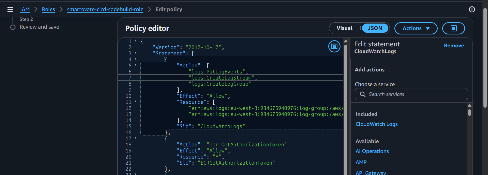

**Ce qu'on voit :** la politique JSON, avec les instructions `CloudWatchLogs` et
`ECRGetAuthorizationToken`.

**Ce que ça démontre — argument fort du rapport :** le cahier des charges
suggérait la politique gérée `AmazonEC2ContainerRegistryPowerUser`, qui donne
accès à **tous** les repositories du compte. Une politique sur mesure a été
préférée, restreinte au seul repository du projet.

**Seule exception, à expliquer :** `ecr:GetAuthorizationToken` porte
obligatoirement sur `"Resource": "*"`. C'est une action de **niveau compte** que
l'API IAM ne permet pas de restreindre à un repository. L'omettre produit
exactement l'erreur d'authentification décrite au cahier des charges (« Bug 2 »).

> *Légende : « Politique IAM sur mesure appliquant le moindre privilège : droits
> de publication restreints au seul repository du projet. L'unique action de
> portée globale, `ecr:GetAuthorizationToken`, ne peut pas être restreinte par
> l'API IAM. »*

## S2-09 — ⭐ Les tests unitaires s'exécutent (US 2.1)

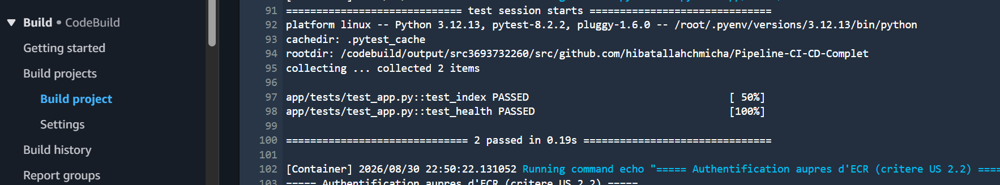

**Ce qu'on voit :** dans les logs du build,
`app/tests/test_app.py::test_index PASSED`,
`test_health PASSED`, puis `2 passed in 0.19s`.

**Ce que ça démontre :** le critère central de l'US 2.1 — les tests unitaires
s'exécutent réellement dans la chaîne automatisée, et non sur le poste du
développeur. Aucune image ne peut être publiée si un test échoue.

> *Légende : « Exécution automatique des tests unitaires dans la chaîne
> d'intégration : aucune image n'est publiée si un test échoue. »*

## S2-10 — ⭐ Traçabilité par le SHA du commit (US 2.2)

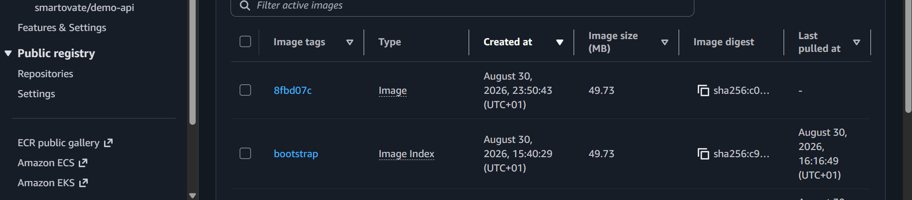

**Ce qu'on voit :** le registre ECR contenant deux images : `bootstrap`
(amorçage manuel) et **`8fbd07c`** (produite par CodeBuild).

**Ce que ça démontre :** le tag `8fbd07c` **est** l'identifiant du commit
construit. Le critère de traçabilité de l'US 2.2 est satisfait : pour toute
image déployée, on retrouve le code source exact dont elle provient.

> *Légende : « Chaque image porte le SHA du commit dont elle est issue : toute
> version déployée est traçable jusqu'à son code source. »*

---

# Sprint 4 — Epic 4 : Orchestration du pipeline

> Couvre les **US 4.1** (pipeline Source → Build → Deploy, déclenchement
> automatique) et **US 4.2** (notifications).

## S4-01 — Connexion GitHub autorisée

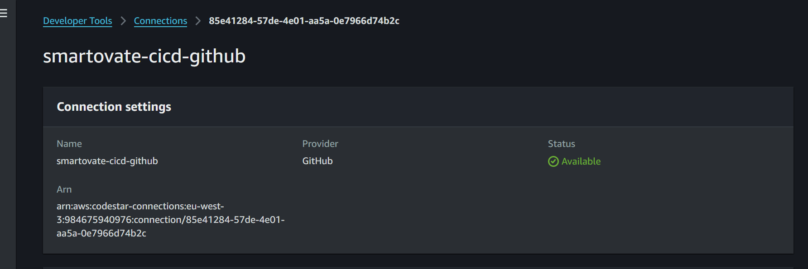

**Ce qu'on voit :** la connexion `smartovate-cicd-github` à l'état
**Available**.

**Ce que ça démontre — étape manuelle obligatoire :** Terraform crée la
connexion à l'état `PENDING`. L'autorisation OAuth doit être accordée à la main
dans la console AWS. Tant que l'état n'est pas `Available`, l'étape Source échoue
et le pipeline ne se déclenche pas. C'est exactement le « Bug 3 » anticipé au
cahier des charges.

**Ce point mérite d'être souligné :** certaines opérations exigent
intentionnellement une intervention humaine. L'automatisation par le code a des
limites, ici pour des raisons de sécurité — une machine ne peut pas s'accorder
elle-même l'accès à un dépôt.

> *Légende : « Connexion GitHub autorisée. L'établissement du lien de confiance
> entre AWS et GitHub requiert une validation manuelle : automatisation et
> sécurité imposent ici une frontière. »*

## S4-02 — Échec du build sur les artefacts S3

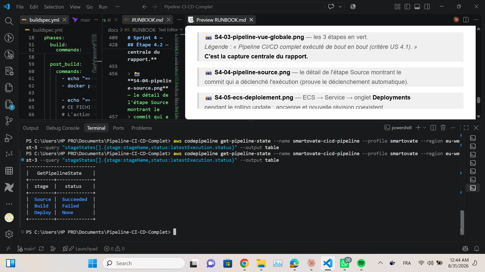

**Ce qu'on voit :** le pipeline avec `Source: Succeeded` et `Build: Failed`.

**Ce que ça démontre — incident instructif :** le **même projet CodeBuild**,
avec un `buildspec.yml` identique, fonctionnait en autonome au Sprint 2 et
échouait ici. En mode pipeline, CodeBuild ne clone plus GitHub : il lit
l'artefact de source déposé dans un bucket S3 et y réécrit son résultat. Cette
nouvelle dépendance n'était pas couverte par la politique IAM.

**Enseignement à formuler :** changer l'architecture change les dépendances, donc
les permissions requises — même à code inchangé.

> *Légende : « Le passage en mode pipeline introduit une dépendance à S3 absente
> du fonctionnement autonome : les permissions IAM doivent suivre l'évolution de
> l'architecture, à code de build identique. »*

## S4-03 et S4-04 — Progression du pipeline

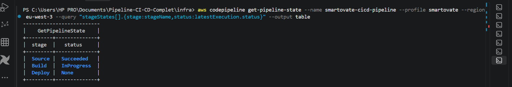
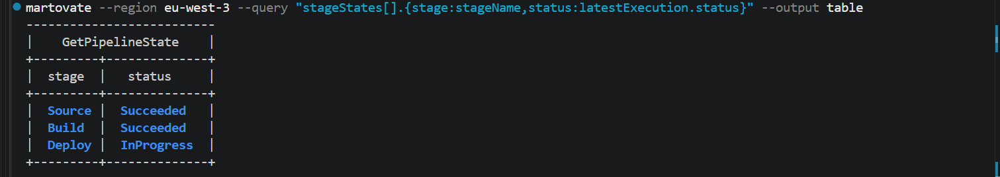

**Ce qu'on voit :** les étapes franchies successivement — Source réussie puis
Build en cours, ensuite Build réussie puis Deploy en cours.

**Ce que ça démontre :** l'enchaînement séquentiel et automatique. Chaque étape
ne démarre que si la précédente a réussi ; un échec interrompt la chaîne et
empêche tout déploiement défectueux d'atteindre la production.

> *Légende : « Enchaînement séquentiel des étapes : un échec en amont bloque le
> déploiement. »*

## S4-05 — ⭐⭐ Le pipeline complet réussi (US 4.1)

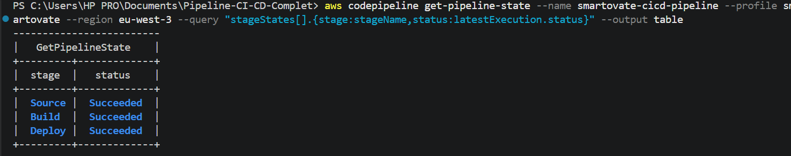

**Ce qu'on voit :** les trois étapes — Source, Build, Deploy — toutes à l'état
`Succeeded`.

**Ce que ça démontre :** l'objectif central du projet. Une modification du code
source parcourt seule tout le chemin jusqu'à l'exécution en production : plus
aucune intervention manuelle entre le commit et le déploiement.

> **C'est la capture centrale du rapport.** À placer en tête de la section
> résultats, ou en illustration de la conclusion.

> *Légende : « Pipeline CI/CD exécuté de bout en bout : du code source au
> déploiement en production, sans intervention manuelle (US 4.1). »*

## S4-06 — ⭐⭐ APRÈS déploiement : la nouvelle version en ligne

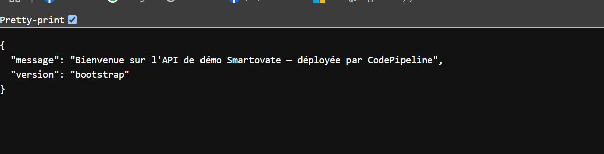

**Ce qu'on voit :** le navigateur affichant la réponse JSON de l'application,
avec le message **modifié** — « déployée par CodePipeline ».

**Ce que ça démontre :** la boucle est bouclée. Le texte visible ici provient
d'une modification du code source poussée sur GitHub ; il n'a jamais été déployé
à la main. C'est la preuve visuelle que la chaîne fonctionne de bout en bout.

> **À placer en vis-à-vis de la capture S3-15 (erreur 503).** Le contraste
> avant/après est l'illustration la plus convaincante du rapport.

> *Légende : « Après déploiement automatique : l'application sert la nouvelle
> version du code, publiée par le pipeline sans aucune intervention manuelle. »*

---

# Récapitulatif : quelle capture prouve quel critère

| Critère du cahier des charges | Capture(s) |
|---|---|
| **US 1.2** — Repository ECR privé, scan à la poussée | S3-17, S2-10 |
| **US 2.1** — Tests unitaires exécutés par le build | **S2-09**, S2-07 |
| **US 2.1** — Image Docker construite avec succès | S2-07, S2-02 |
| **US 2.2** — Image taguée avec le SHA du commit | **S2-10** |
| **US 2.2** — Rôle IAM disposant des droits ECR | **S2-08** |
| **US 3.1** — Cluster ECS et ALB créés par IaC | S3-18, S3-11 |
| **US 3.1** — ALB public avec Target Group et Listener | S3-11, S3-12, S3-13 |
| **US 3.1** — Security Groups correctement configurés | **S3-10**, S3-08 |
| **US 3.1** — Haute disponibilité (2 zones) | **S3-07**, S3-06, S3-12 |
| **US 3.2** — Task Definition référençant l'image ECR | S3-21 |
| **US 3.2** — 0,25 vCPU et 512 Mo | S3-21 |
| **US 3.2** — Au moins 2 tâches en exécution | **S3-19**, S3-20 |
| **US 3.2** — Service associé au Target Group | **S3-22** |
| **US 3.2** — Application accessible via le DNS de l'ALB | **S4-06**, S3-12 |
| **US 4.1** — Pipeline à trois étapes fonctionnel | **S4-05** |
| **US 4.1** — Déclenchement automatique sur push | S4-03, S4-05 |
| **US 4.1** — Étape Deploy mettant à jour le service ECS | S4-04, S4-06 |
| **Bug 1** — Health Check (prévention) | **S3-14**, S3-22 |
| **Bug 2** — Authentification ECR (prévention) | **S2-08**, S2-02 |
| **Bug 3** — Déclenchement du pipeline | **S4-01** |

# Les six captures à retenir si la place manque

1. **S4-05** — le pipeline complet réussi *(le résultat du projet)*
2. **S3-15 + S4-06** — le couple avant/après *(la démonstration visuelle)*
3. **S3-10** — la référence entre groupes de sécurité *(la rigueur sécurité)*
4. **S2-09** — les tests automatisés *(la qualité)*
5. **S2-10** — la traçabilité par SHA de commit *(la maîtrise des versions)*

# Captures restant à réaliser

L'US 4.2 (notifications) n'est pas encore illustrée. Il manque :

- le topic SNS et son abonnement à l'état **Confirmed** ;
- la règle EventBridge et son motif de filtrage ;
- le mail de notification reçu.

L'abonnement était en attente de confirmation au moment de la rédaction :
l'adresse enregistrée doit valider le lien envoyé par AWS.
